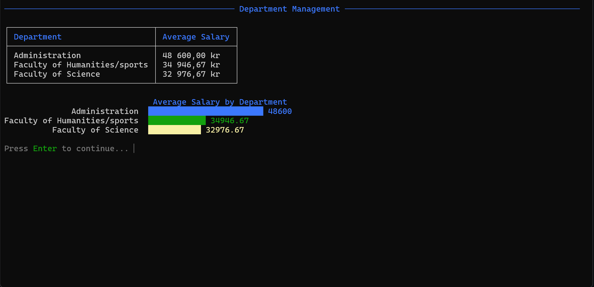

# School Management System

## Overview
A C# console application for managing a school database using Entity Framework Core with a Database First approach. The application provides an intuitive interface for managing students, employees, courses, and grades, featuring colorful visualizations using Spectre.Console.

## Features Showcase

### Department Salary Visualization
The application provides colorful bar charts for salary distribution:



## Technical Stack
- C# (.NET 8.0)
- Entity Framework Core (Database First)
- SQL Server
- Spectre.Console for UI enhancement

## Prerequisites
- Visual Studio 2022 or newer
- SQL Server (Local or Express)
- .NET 8.0 SDK

## Required NuGet Packages
```shell
// For Entity Framework connection
Microsoft.EntityFrameworkCore
Microsoft.EntityFrameworkCore.SqlServer
Microsoft.EntityFrameworkCore.Design

// For json configuration file
Microsoft.Extensions.Configuration
Microsoft.Extensions.Configuration.Json

// For UI Console functions 
Spectre.Console
```

## Installation & Setup

### 1. Database Setup
```sql
-- Using SQL Server Management Studio (SSMS)
```

### 2. Application Setup
1. Clone the repository

2. Configure the database connection
   - Change Filename `appsettings.example.json` to `appsettings.json`
   - Update the connection string in `appsettings.json` with your database details:
     ```json
     {
       "ConnectionStrings": {
         "DefaultConnection": "Server=YOUR_SERVER;Database=HighSchool;Trusted_Connection=True;TrustServerCertificate=True;"
       }
     }
     ```

3. Build and run
```bash
dotnet build
dotnet run
```

## Project Structure
```
SchoolManagement/
├── Core/
│   ├── Interfaces/        # Service interfaces
│   └── Services/          # Service implementation
├── Data/
│   └── SchoolContext.cs   # EF Core context
├── Models/                # Database entities
├── UI/
│   ├── Menus/            # Menu implementations
│   └── MenuOptions/      # Menu enumerations
└── Program.cs            # Application entry point
```

## Menu Structure
- Main Menu
  - Student Management
  - Employee Management
  - Course Management
  - Department Management
  - Grade Management

## Data Validation
- PIN Format (YYYYMMDD-XXXX) (Swedish personal identification number)
- Grade Validation (A-F)

## License
Feel free to use this school project as you wish 
